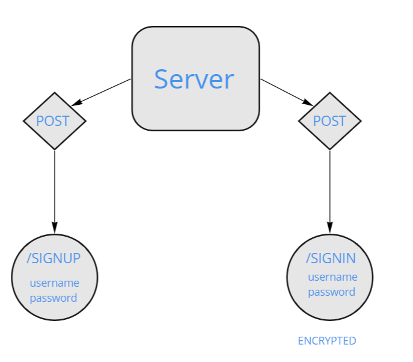

# Basic Authentication'

Author: Katy Roffe

## Installations

* `npm install dotenv express jest sequelize pg sqlite3 bcrypt base-64`

## Problem Domain

Deploy an Express server that implements Basic Authentication, with signup and signin capabilities, using a Postgres database for storage.

## UML

## Routes

* /signup
* /signin
